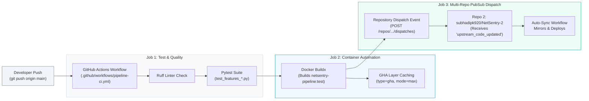
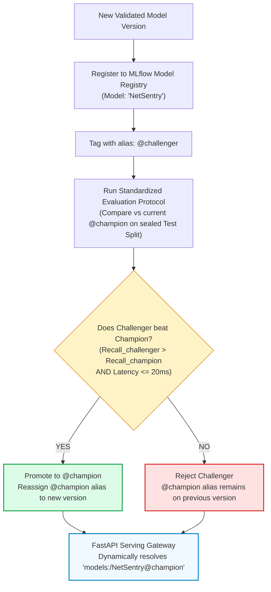

# NetSentry v2 — System Architecture, Workflows & Infrastructure Blueprint

This document details the architectural design, distributed components, containerization, data pipelines, model lifecycle governance, and automated CI/CD synchronization workflows powering **NetSentry v2**.

---

## 1. High-Level Architecture Flowchart

The following flowchart illustrates the end-to-end data lifecycle: from raw high-volume network flow ingestion to real-time inference and continuous MLOps feedback.

```mermaid
flowchart TD
    subgraph S1["1. Data Ingestion & Sanitization"]
        R2["Cloudflare R2 Object Store<br/>(clean_network_flows.parquet)"] --> VAL["Schema Validation & Header Sanitization<br/>(netsentry.data.validator)"]
        VAL --> CLEAN["Data Cleaning Engine<br/>• Drop metadata (IPs, Ports, Timestamps)<br/>• Handle Inf/NaN via imputation<br/>• Binary target mapping (0=Benign, 1=Attack)"]
    end

    subgraph S2["2. Feature Engineering & Isolation"]
        CLEAN --> FEAT["Domain Feature Synthesis (Polars)<br/>• Forward/Backward packet & byte ratios<br/>• SYN-without-ACK flag indicators<br/>• RST flag & packet densities"]
        FEAT --> SPLIT["Stratified Splitting Protocol<br/>• 70% Training Split (~1.75M flows)<br/>• 15% Validation Split (~375k flows)<br/>• 15% Test Split (Untouched & Sealed)"]
    end

    subgraph S3["3. Baseline Tournament & HPO"]
        SPLIT --> TOUR["Multi-Model Benchmark Tournament<br/>(XGBoost, LightGBM, CatBoost, LogReg, SVM)"]
        TOUR --> SEL["Select Top Model on Validation PR-AUC"]
        SEL --> OPTUNA["Optuna Bayesian HPO Engine<br/>(TPE Search on Hyperparameter Space)"]
    end

    subgraph S4["4. Decision Calibration & Quality Audit"]
        OPTUNA --> THRESH["Decision Threshold Tuning<br/>(Sweep cutoffs on validation for Attack Recall >= 0.90)"]
        THRESH --> FREEZE["Freeze Optimal Threshold (tau*)"]
        FREEZE --> TEST["Evaluate on Sealed 15% Test Split"]
        TEST --> GATE{"Automated Quality Gate<br/>Recall >= 0.90 & FPR <= 0.02?"}
    end

    subgraph S5["5. Model Registry & Serving"]
        GATE -- PASS --> MLFLOW["MLflow Tracking & Model Registry<br/>(PostgreSQL Backend + R2 Storage)"]
        GATE -- FAIL --> REJECT["Reject Candidate Artifact"]
        MLFLOW --> CHAMP["Champion-Challenger Promotion<br/>Assign @champion Alias"]
        CHAMP --> FASTAPI["FastAPI Serving Microservice<br/>(Dockerized In-Memory Inference)"]
        FASTAPI --> DECISION["Live Prediction Response<br/>(BENIGN 200 OK vs ATTACK Alert)"]
    end

    style S1 fill:#f8fafc,stroke:#cbd5e1,stroke-width:1px
    style S2 fill:#f8fafc,stroke:#cbd5e1,stroke-width:1px
    style S3 fill:#f8fafc,stroke:#cbd5e1,stroke-width:1px
    style S4 fill:#f8fafc,stroke:#cbd5e1,stroke-width:1px
    style S5 fill:#f8fafc,stroke:#cbd5e1,stroke-width:1px
    style CHAMP fill:#dcfce7,stroke:#16a34a,stroke-width:2px
    style REJECT fill:#fee2e2,stroke:#dc2626,stroke-width:2px
```



---

## 2. Tools & Technologies Breakdown

| Category | Tool / Technology | Role in Architecture |
| :--- | :--- | :--- |
| **Data & Query Engine** | **Polars (Rust)** | High-speed vectorized data transformation, schema validation, and feature generation across 2.5M+ rows without memory exhaustion. |
| **Object Storage** | **Cloudflare R2** | High-throughput, S3-compatible cloud bucket storing master Parquet datasets and sealed model binary artifacts. |
| **Experiment Tracking** | **MLflow** | Tracks parameters, PR-AUC / ROC-AUC metrics, confusion matrices, and model artifact signatures. |
| **Metadata Database** | **Aiven PostgreSQL** | Managed cloud database (`mlflow_db`) acting as the persistent central tracking and model registry store. |
| **Hyperparameter Tuning** | **Optuna** | Automated Bayesian optimization utilizing Tree-structured Parzen Estimators (TPE) with early trial pruning. |
| **Microservice Serving** | **FastAPI + Uvicorn** | Asynchronous REST API serving real-time predictions (`/v1/predict`) with sub-20ms p95 latency. |
| **Containerization** | **Docker & Docker Compose** | Reproducible multi-stage production images isolating training pipelines and inference servers. |
| **Pipeline Orchestration**| **Apache Airflow** | Scheduled 14-day continuous retraining DAG isolating tasks with `DockerOperator`. |
| **CI/CD & Event Sync** | **GitHub Actions + PubSub** | Automated test/lint validation, Docker image building, and multi-repo dispatch synchronization. |

---

## 3. Containerization Architecture & Docker Images

NetSentry v2 uses **two custom production container images** plus modular compose services.

### A. Container Images Built in the Project

#### 1. `netsentry-pipeline:latest` (`docker/Dockerfile.pipeline`)
- **Purpose**: Heavy training, feature engineering, Optuna Bayesian tuning, and MLflow registration.
- **Multi-stage build**:
  - *Stage 1 (Builder)*: Uses `python:3.11-slim` + `build-essential` + `libgomp1` to compile wheels for XGBoost, LightGBM, CatBoost, Scikit-learn, and Polars into `/build/wheels`.
  - *Stage 2 (Runtime)*: Minimal `python:3.11-slim` runtime containing only pre-built wheels, non-root application user (`appuser`), and pipeline source code.
- **Entrypoint**: `python scripts/run_pipeline.py`.

#### 2. `netsentry-server:latest` (`docker/Dockerfile.server`)
- **Purpose**: Lightweight production serving and API gateway.
- **Runtime**: `python:3.11-slim` with OpenMP runtime (`libgomp1`) and `curl` for health checks.
- **Dependencies**: Stripped down runtime (`requirements.serving.txt`) without heavy training tools like Optuna.
- **Security & Healthcheck**:
  ```dockerfile
  HEALTHCHECK --interval=30s --timeout=5s --start-period=20s --retries=3 \
      CMD curl -f http://localhost:8000/health || exit 1
  ```
- **Entrypoint**: `uvicorn netsentry.serving.app:app --host 0.0.0.0 --port 8000`.

### B. Supporting Service Containers (Docker Compose)
- **Airflow Webserver & Scheduler**: `apache/airflow:2.8.1-python3.10` managing automated retraining DAGs.
- **Airflow Metadata Store**: `postgres:15-alpine` storing task run state.
- **Local MLflow Server**: Dedicated container configured with SQLite/Postgres and Cloudflare R2 S3 endpoints.

---

## 4. GitHub Actions CI/CD & Automated Container Build Flow

Whenever code is pushed to GitHub, GitHub Actions executes tests, builds the container image, and publishes a synchronization event to secondary repositories.



### How Pushing New Code Auto-Builds the Container:
1. **Trigger Filter**: The workflow triggers automatically on pushes to `main` (ignoring changes that touch only `configs/**` or `*.md` to avoid unnecessary builds).
2. **Quality Barrier**:
   - `ruff check netsentry/ configs/ scripts/` validates code quality and formatting.
   - `pytest tests/` runs the test suite against features, models, and data validation logic.
3. **Automated Docker Build**:
   - Uses `docker/setup-buildx-action@v3` and `docker/build-push-action@v5`.
   - Compiles `docker/Dockerfile.pipeline` inside GitHub's ephemeral Ubuntu runners.
   - Utilizes GitHub Actions cache (`type=gha`) so subsequent runs reuse cached layers, cutting build time from 8 minutes down to under 45 seconds.
4. **Multi-Repo PubSub Event (Repository Dispatch)**:
   Once the Docker container builds successfully, GitHub Actions triggers an automated webhook to the secondary deployment repository:
   ```yaml
   - name: Dispatch Event to Repo 2
     run: |
       curl -X POST \
         -H "Accept: application/vnd.github.v3+json" \
         -H "Authorization: token ${{ secrets.DISPATCH_PAT }}" \
         https://api.github.com/repos/subhadipk920/NetSentry-2/dispatches \
         -d '{"event_type":"upstream_code_updated"}'
   ```
   This acts as a decentralized **publish-subscribe event**, allowing `NetSentry-2` to ingest code changes and deploy updates with zero human intervention.

---

## 5. Model Registry & Champion–Challenger Lifecycle

NetSentry deprecates static model paths and staging flags in favor of **Dynamic MLflow Operational Aliases**:



### Key Governance Guarantees:
- **Atomic Threshold Binding**: When version $V_n$ is registered, its exact validation-calibrated decision threshold $\tau^*$ is saved in its run metadata. The serving container loads the model and threshold together, guaranteeing that decision cutoffs always match the model weights.
- **Zero-Downtime Rollback**: If an unexpected anomaly degrades production accuracy, moving `@champion` back to $V_{n-1}$ in MLflow instantly updates the running FastAPI server without rebuilding images or redeploying containers.
